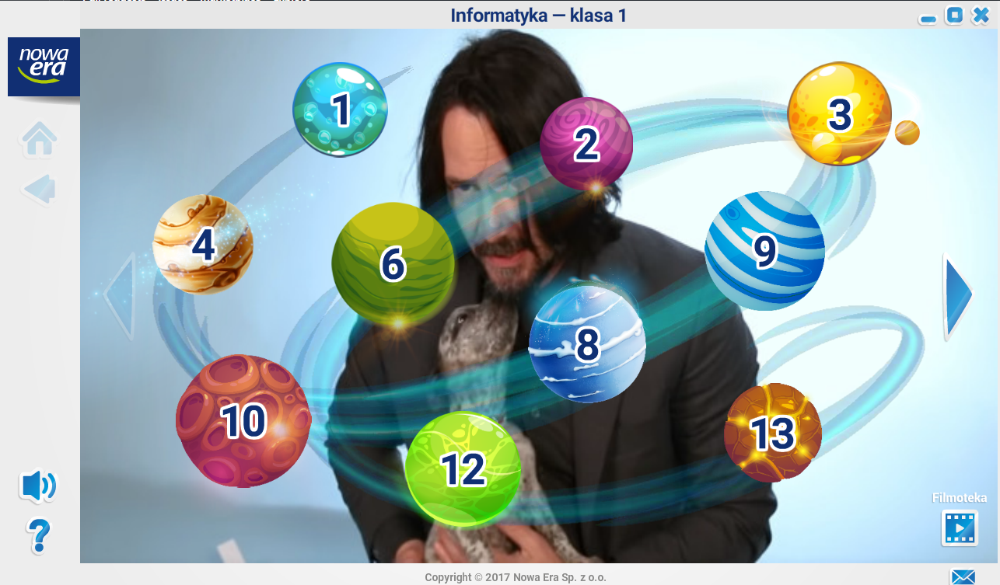
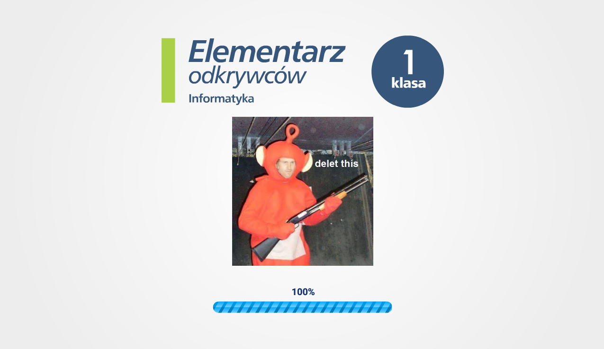
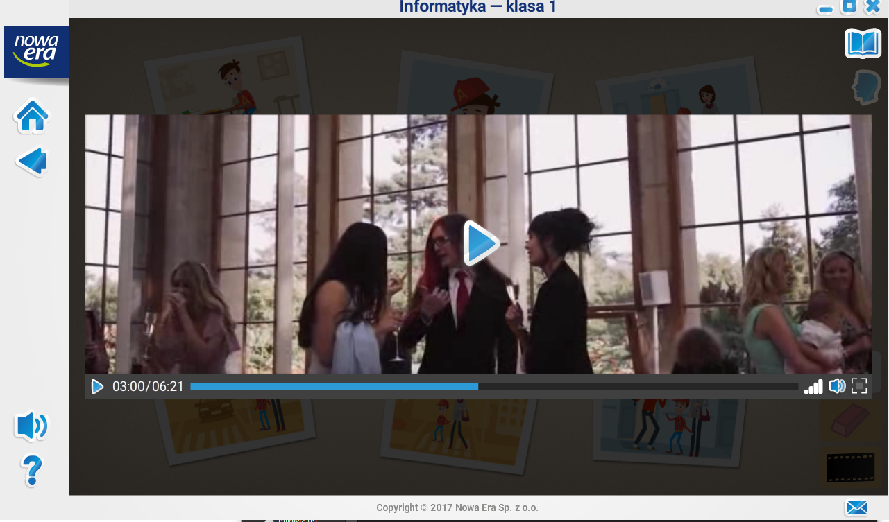
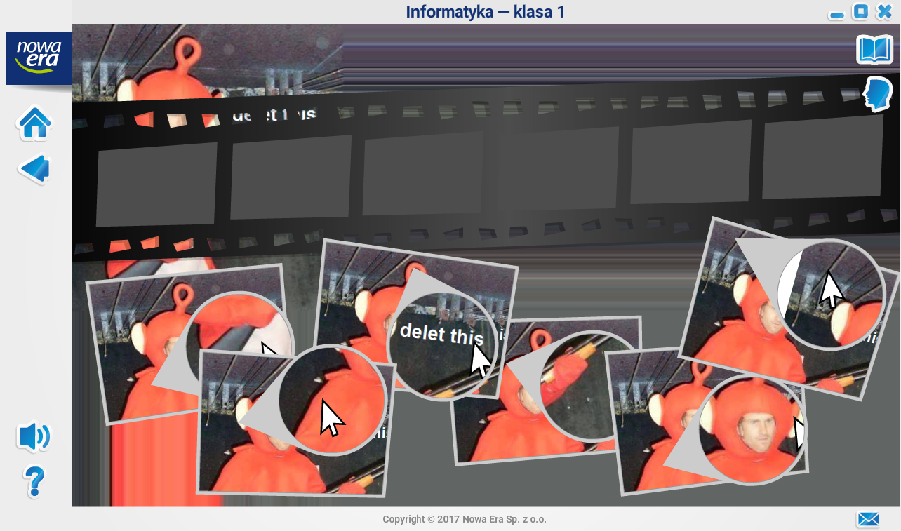

# nowa-era-dk  
Development kit dla programów z nowej ery  
**Jak używać?**  
Skopiuj program z nowej ery do katalogu app  
**Weryfikowane gry/aplikacje**  
Podręcznik do informatyki klasa 1  
**Pobierz**  
[Pobieranie](https://github.com/ProgramistaZpolski/nowa-era-dk/releases)
**Kup podrecznik do informatyki jesli nie chcesz piracić gier z niego**
[Kup podreczik za 15 PLN](https://sklep.nowaera.pl/product/elementarz-odkrywcow-zeszyt-cwiczen-z-cd-informatyka-klasa-1-061116?gclid=CjwKCAiAzuPuBRAIEiwAkkmOSK6CYbhrI2YQm7THcrfCE7Iy0d_D-kmhSLB_xhQ7AL8-iXKDwtgtYxoCEloQAvD_BwE)
**Przykłady działania**

